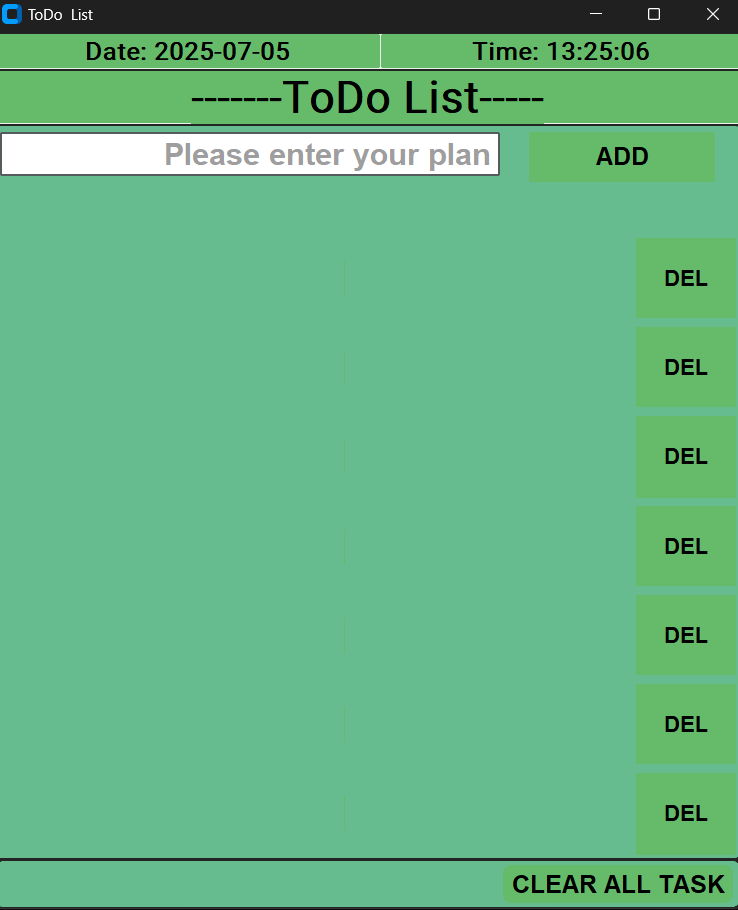

# TODO_List with customtkinter

Program features

-show date and time
-add plan or task
-delete all task
-delete one plan at a time

Requirements
-customtkinter library

'''bash
pip install customtkinter

project picture

